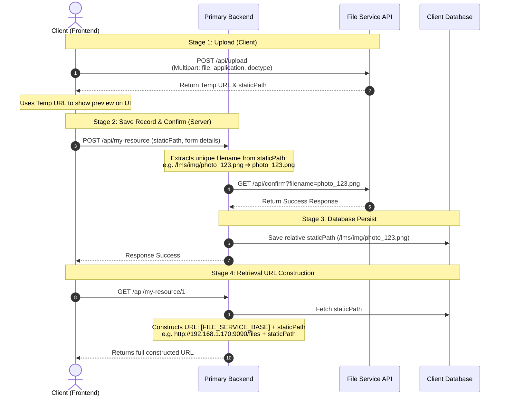

# API Documentation: Client-Server File Upload & Confirmation Guide

This guide details the decoupled integration pattern for the `file-service`. In this architecture:
1. **The Client (Frontend)** uploads files directly to the file service and uses the temp URL for instant UI preview.
2. **The Primary Backend** performs confirmation on the server-to-server layer, extracts the filename, confirms it, and persists the relative `staticPath` in its database.
3. **Static URLs** are dynamically constructed during retrieval.

---

## 🔄 Lifecycle Architecture



---

## 📤 1. Upload File (Stage 1 - Frontend Client)

Uploads the file directly from the user's browser to the file service.

* **URL:** `http://192.168.1.170:9090/api/upload`
* **Method:** `POST`
* **Content-Type:** `multipart/form-data`
* **Auth Required:** No

### Request Parameters

| Parameter | Type | Required | Description |
| :--- | :---: | :---: | :--- |
| `file` | File | Yes | File binary (e.g., png, pdf, docx). |
| `application` | Integer | Yes | The ID of the application (e.g. `1` for `lms`). |
| `doctype` | Integer | Yes | The ID of the document type (e.g. `2` for `employeeimage`). |

### Success Response (`200 OK`)

```json
{
  "staticPath": "/lms/employeeimage/png/myphoto_1716948271a2d3f.png",
  "url": "http://192.168.1.170:9090/files/temp/lms-employeeimage-png-myphoto_1716948271a2d3f.png",
  "statusCode": 200,
  "message": "File uploaded successfully",
  "success": true
}
```

* **Frontend Action:** Use the transient preview `url` to show the file to the user instantly. Send the relative `staticPath` to your primary backend.

---

## 📥 2. Confirm File (Stage 2 - Primary Backend)

Triggered server-to-server by your primary backend before saving the record to the database.

* **URL:** `http://192.168.1.170:9090/api/confirm`
* **Method:** `GET`
* **Auth Required:** No (Public endpoint since it is executed internally/behind the firewall)

### Query Parameters

| Parameter | Type | Required | Description |
| :--- | :---: | :---: | :--- |
| `filename` | String | Yes | The extracted unique filename (e.g., `myphoto_1716948271a2d3f.png`). |

### Success Response (`200 OK`)

```json
{
  "staticPath": "/lms/employeeimage/png/myphoto_1716948271a2d3f.png",
  "url": "http://192.168.1.170:9090/files/lms/employeeimage/png/myphoto_1716948271a2d3f.png",
  "statusCode": 200,
  "message": "File confirmed successfully",
  "success": true
}
```

---

## 💻 Code Examples

### 1. Frontend: Uploading & Submitting staticPath

```javascript
// Environment config
const FILE_SERVICE_API = "http://192.168.1.170:9090";
const PRIMARY_BACKEND_API = "http://localhost:8080";

async function handleFileUpload(event) {
  const file = event.target.files[0];
  
  // 1. Upload directly to File Service
  const formData = new FormData();
  formData.append('file', file);
  formData.append('application', 1); // e.g. LMS
  formData.append('doctype', 2);     // e.g. Employee Image

  const uploadRes = await fetch(`${FILE_SERVICE_API}/api/upload`, {
    method: 'POST',
    body: formData
  });
  
  const uploadData = await uploadRes.json();
  
  if (uploadData.success) {
    // 2. Display temp preview URL on client UI
    displayPreviewImage(uploadData.url); 
    
    // 3. Submit staticPath to Primary Backend along with the rest of the form
    await submitFormToPrimaryBackend({
      username: "John Doe",
      profilePicturePath: uploadData.staticPath // Save relative path
    });
  }
}

async function submitFormToPrimaryBackend(payload) {
  await fetch(`${PRIMARY_BACKEND_API}/api/users`, {
    method: 'POST',
    headers: { 'Content-Type': 'application/json' },
    body: JSON.stringify(payload)
  });
}
```

### 2. Primary Backend: Confirming & Saving staticPath (Java / Spring Boot Example)

```java
import org.springframework.web.bind.annotation.*;
import org.springframework.web.client.RestTemplate;
import org.springframework.http.ResponseEntity;

@RestController
@RequestMapping("/api/users")
public class UserController {

    private final UserRepository userRepository;
    private final RestTemplate restTemplate = new RestTemplate();
    
    private final String FILE_SERVICE_BASE = "http://192.168.1.170:9090";

    public UserController(UserRepository userRepository) {
        this.userRepository = userRepository;
    }

    @PostMapping
    public ResponseEntity<?> createUser(@RequestBody UserDto userDto) {
        // 1. Extract file name from relative staticPath
        // Input: "/lms/employeeimage/png/myphoto_1716948271a2d3f.png"
        String staticPath = userDto.getProfilePicturePath();
        String filename = staticPath.substring(staticPath.lastIndexOf("/") + 1);

        // 2. Call File Service Confirmation Endpoint
        String confirmUrl = FILE_SERVICE_BASE + "/api/confirm?filename=" + filename;
        FileServiceResponse response = restTemplate.getForObject(confirmUrl, FileServiceResponse.class);

        if (response != null && response.isSuccess()) {
            // 3. Save relative path in Database
            User user = new User();
            user.setName(userDto.getName());
            user.setProfilePicturePath(staticPath); // "/lms/employeeimage/png/myphoto_1716948271a2d3f.png"
            userRepository.save(user);
            return ResponseEntity.ok("User created successfully");
        }

        return ResponseEntity.badRequest().body("File confirmation failed");
    }
}
```

---

## 🔗 URL Construction on Retrieval

When the client requests data, the primary backend builds the absolute URL on-the-fly and returns it.

### Example Database Record
```
id: 1
name: "John Doe"
profile_picture_path: "/lms/employeeimage/png/myphoto_1716948271a2d3f.png"
```

### Java URL Construction Logic

```java
public UserResponseDto getUser(Long id) {
    User user = userRepository.findById(id).orElseThrow();
    
    // File Service Base Asset URL path
    String fileServiceBaseUrl = "http://192.168.1.170:9090/files";
    
    UserResponseDto dto = new UserResponseDto();
    dto.setName(user.getName());
    
    // Construct Url: base_url + staticPath
    dto.setProfilePictureUrl(fileServiceBaseUrl + user.getProfilePicturePath());
    
    return dto;
}
```

### Response Returned to Client
```json
{
  "name": "John Doe",
  "profilePictureUrl": "http://192.168.1.170:9090/files/lms/employeeimage/png/myphoto_1716948271a2d3f.png"
}
```
Client uses this absolute `profilePictureUrl` directly in the HTML resource target (e.g., ``).
